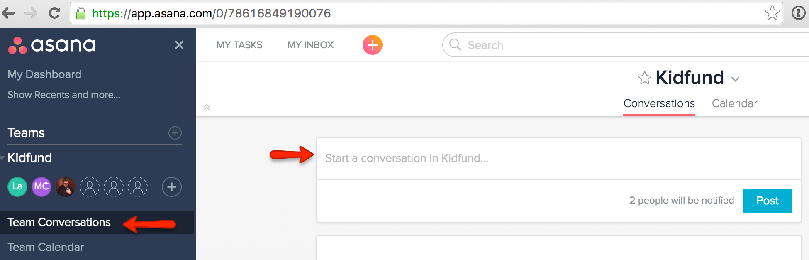

# Asana

We use [Asana](https://app.asana.com "Asana") for:

 * Longform communication
 * Tracking Decisions
 * Project and Company todo's
 * The Kidfund system's high level backlog

Asana makes it easy to keep conversations consolidated. To start a new conversation you can:

* Go to "Team Conversations" and start writing 
* Click the + and "New Conversation" 
* Send an email to [kidfund@mail.asana.com](mailto:kidfund@mail.asana.com "kidfund@mail.asana.com") with the subject as the title of your conversation and the message in the body

To reply to a conversation you can:

* Reply in browser or app
* Reply to an email you received from Asana

*If you are unsure on whether to email or Asana, choose Asana!*