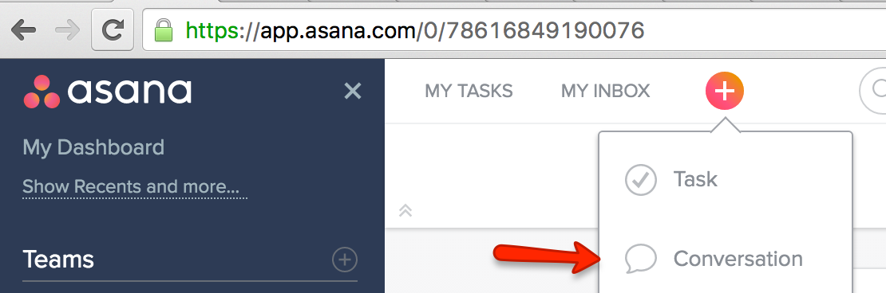
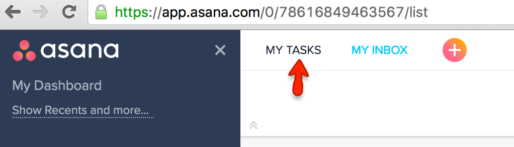

# Asana

We use [Asana](https://app.asana.com "Asana") for:

 * Longform communication
 * Tracking Decisions
 * Project and Company tasks
 * The Kidfund system's high level backlog

## Conversations

Asana makes it easy to keep conversations consolidated. To start a new conversation you can:

* Go to "Team Conversations" and start writing 
* Click the + and "New Conversation" 
* Send an email to [kidfund@mail.asana.com](mailto:kidfund@mail.asana.com "kidfund@mail.asana.com") with the subject as the title of your conversation and the message in the body

To reply to a conversation you can:

* Reply in browser or app
* Reply to an email you received from Asana

*If you are unsure on whether to email or Asana, choose Asana!*

## Tasks

You can view tasks assigned to you by clicking "My Tasks" at the top of the screen 

New company or project tasks currently get created in the [Beta](https://app.asana.com/0/109029161368015/list "Beta") project

If you have an idea of something we should be working on next, add it to the [backlog](https://app.asana.com/0/110356272035859/list "backlog"). Once a decision has been made to begin work on something in the backlog, it gets broken down into [Pivotal Tracker](https://github.com/Kidfund/company/blob/master/software/Pivotal_Tracker.md "Pivotal Tracker") stories for Design and Development