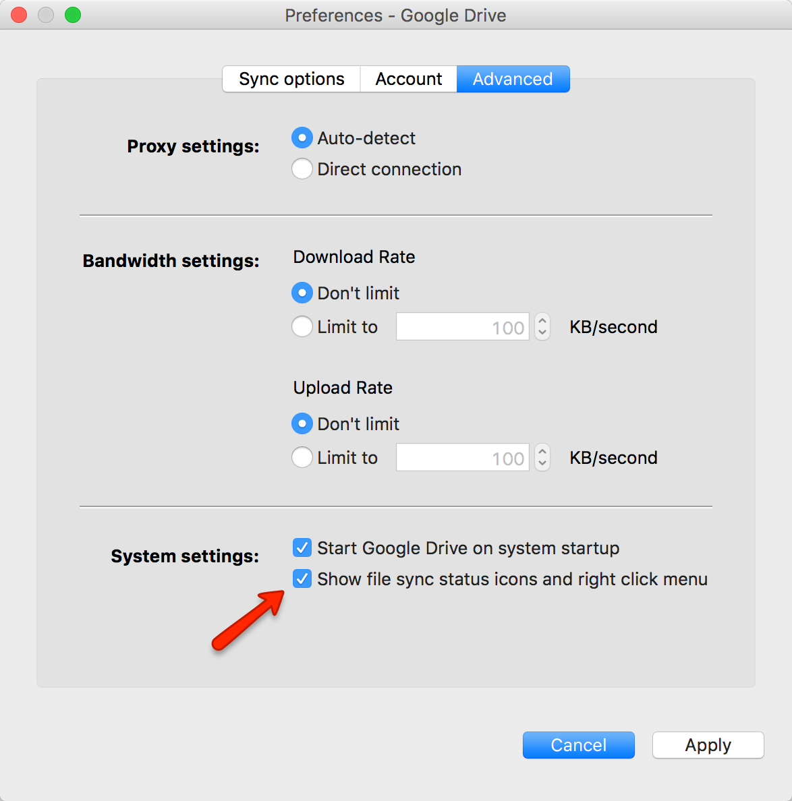
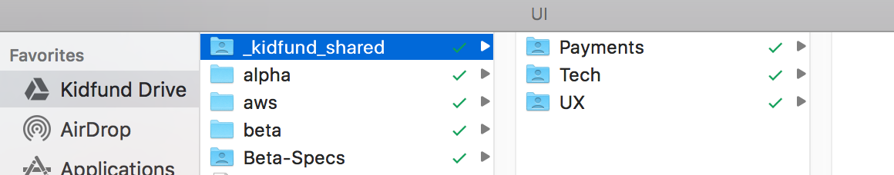
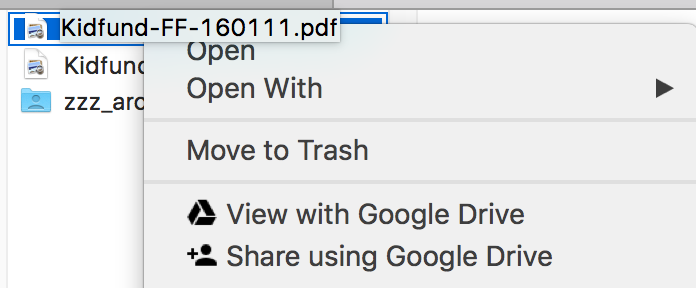

# Google Drive

Google Drive can be used for both document collaboration and sharing files. As we don't have a central office with a server sitting in it, Google Drive is also our shared drive.

## Shared Drive

To use Google Drive the same way you would a network share. Follow these steps:

1. Download and install Google Drive for [your mac](https://www.google.com/drive/download/ "your mac")
2. Rename from "Google Drive" to "Kidfund Drive" during installation if you choose
3. After installation make sure that these two advanced options are checked. These make sure that Google Drive is running and give you integration with Finder. 
4. Our shared drive is _kidfund_shared which you should see at the top. Every employee has access to this folder. 
5. Finder integration lets you know if the file has been synced and gives you options to view the file online or share it 

## Collaboration and Comments

*Coming soon*